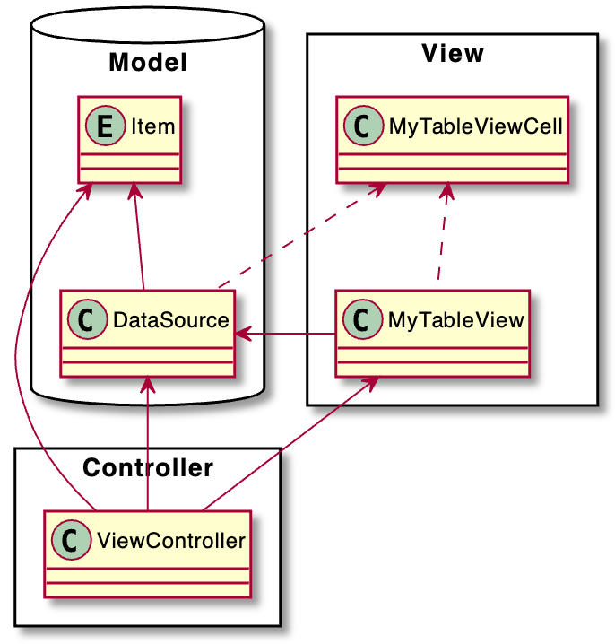

# MVC, Model - View - Controller

## MVC Pattern

-   Model - View - Controller란?
-   MVC는 전략, 컴포지트, 옵저버 패턴이 결합된 패턴이다.

### MVC 패턴 역할 분리

MVC 패턴은 모델, 뷰, 컨트롤러로 이루어진 패턴입니다. 뷰는 유저 인터페이스를 표현하고 관리합니다. 그리고 컨트롤러에 유저 액션을 전달합니다. 모델은 애플리케이션에서 사용하는 데이터를 관리하고 컨트롤러에 데이터의 변화를 알립니다. 컨트롤러는 뷰와 모델의 다리 역할을 하며 뷰와 모델의 업데이트를 담당합니다.

### MVC 패턴을 구현하기 위해 지켜야 할 규칙

1. 모델은 컨트롤러와 뷰에 의존하지 않아야 한다.

    - 모델 내부에 컨트롤러와 뷰에 관련된 코드가 있으면 안 된다.

2. 뷰는 모델에만 의존해야 하고, 컨트롤러에는 의존하면 안 된다.

    - 뷰 내부에 모델의 코드만 존재할 수 있고, 컨트롤러의 코드가 있으면 안 된다.

3. 뷰가 모델로부터 데이터를 받을 때는, 사용자마다 다르게 보여주어야 하는 데이터에 대해서만 받아야 한다.

4. 컨트롤러는 모델과 뷰에 의존해도 된다.

    컨트롤러 내부에는 모델과 뷰의 코드가 있을 수 있다.

5. 뷰가 모델로부터 데이터를 받을 때는 반드시 컨트롤러에서 받아야 한다.

### 모델

-   Item
-   DataSource

### 뷰

-   MyTableView
    -   MyTableViewCell

### 컨트롤러

-   ViewController

## 모델과 뷰와 컨트롤러의 경계는 어디까지인가?

최대한 MVC 정의에 가깝게 프로젝트를 구성했지만 구성하는 도중에 역할과 책임에 대해 고민이 생겼습니다.

1.  컨트롤러에서 뷰의 상태를 정의해야 할까?

    뷰가 스스로 설정할 수 있으면 뷰가 책임을 다할 수 있도록 하는게 맞다고 생각이 들었습니다.

2.  데이터 소스는 모델로 볼 수 있는가?

    모델은 데이터를 정의한다고 하는데 데이터를 가지고 추가적인 책임까지 하는 데이터 소스도 모델이라고 생각이 들었습니다.

3.  뷰의 데이터 소스 설정은 컨트롤러의 역할인가?

    뷰가 스스로 데이터 소스를 설정할 수 있으면 더 좋겠다 생각이 들었습니다.

## 프로젝트 클래스 다이어그램

프로젝트 구성을 가시적으로 보기 위해 클래스 다이어그램을 작성해보았습니다.

