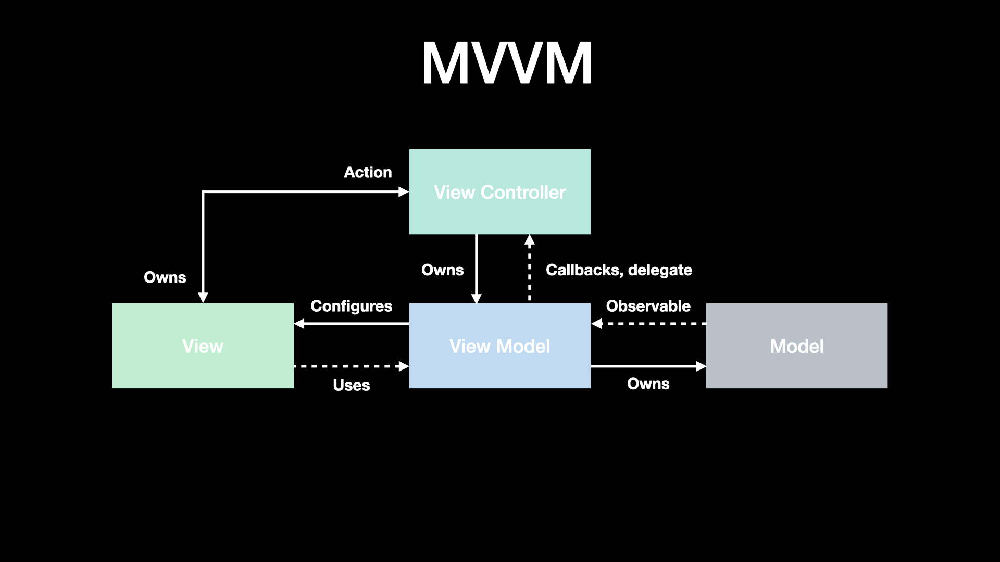

## MVVM

모델은 앱 동작에 필요한 데이터입니다. 뷰는 유저 인터페이스 요소입니다. iOS에는 뷰와 뷰 컨트롤러가 밀접한 관계에 있습니다. 뷰 모델은 뷰의 입력을 통해 모델을 업데이트하고 모델의 출력을 통해 뷰를 업데이트합니다.

MVVM은 다음과 같은 장점이 있습니다.

- Reduced complexity
- Expressive
- Testability

### MVVM의 규칙

### 뷰 컨트롤러

- 뷰 컨트롤러는 뷰의 입력을 받아서 뷰 모델로 전달합니다.

### 뷰 모델

- 뷰의 입력을 받아서 모델을 업데이트합니다.
- 모델의 출력을 바당서 뷰 컨트롤러로 전달합니다.
- 뷰 컨트롤러에서 표시할 모델 데이터를 포맷팅합니다.

MVVM에서는 뷰 모델의 출력을 뷰에 바인딩하는 것이 필요합니다. 바인딩을 하는 방법에는 여러 가지가 있습니다.

- Key-Value Observing or KVO: key path를 사용하여 프로퍼티를 관찰하고 프로퍼티가 변경될 때 알림을 받는 메커니즘입니다.
- Functional Reactive Programming or FRP: 이벤트와 데이터를 스트림으로 처리하는 패러다임입니다. 애플의 Combine 프레임워크는 FRP에 대한 접근 방식입니다. RxSwift와 ReactiveSwift는 FRP에 널리사용하는 프레임워크입니다.
- Delegation: 값이 변경될 때, 델리게이트 메서드를 사용하여 알림을 전달합니다.
- Boxing: 프로퍼티 옵저버를 사용하여 값이 변경될 때 옵저버에게 알립니다.